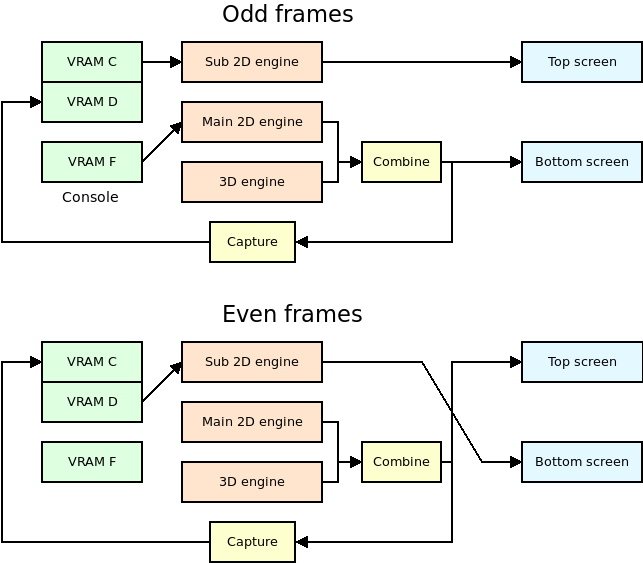
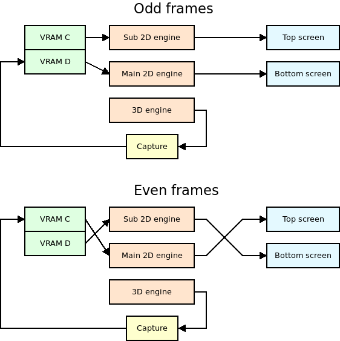
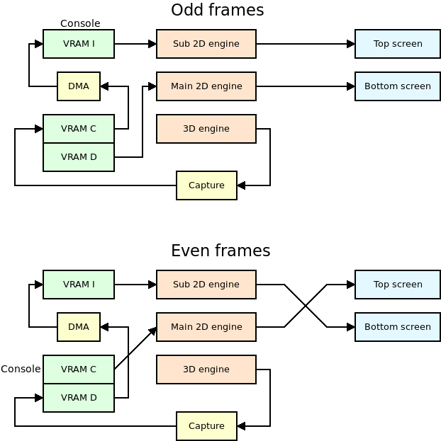

Dual screen 3D modes
####################

The 3D engine of the Nintendo DS 3D can only be used to display 3D graphics on
one screen under normal conditions, but it is possible to display 3D on both
screens by using a special video capture circuit.

This technique isn't straightforward. The video hardware of the NDS is very
flexible, and there are several ways to achieve 3D graphics on both screens.

This document is a very detailed explanation of how it works in Nitro Engine
I've explained the reasons why each mode may be used, as well as their
limitations.

If this document is too long for you to read, just use ``NE_InitDual3D_DMA()``
in your games and skip the read! However, feel free to keep reading if you care
about the details about how all of it is implemented.

Something that applies to all the systems is that the 3D engine can only send
the output to one of the two screens during a specific frame. Any dual 3D setup
implies saving that 3D engine output to VRAM and displaying it on the other
screen during the following frame. Essentially, the main graphics engine and sub
graphics engine need to switch from one screen to the other after every frame.

A huge thanks to mtheal and JustBurn for the `NDS Homebrew VRAM Banks Selector
<https://mtheall.com/banks.html>`_ and the `NDS Homebrew VRAM BG Allocation
Conflict Viewer <https://mtheall.com/vram.html>`_, tools that made my life a lot
easier when working on this. Check them out, and their source code on `GitHub
<https://github.com/mtheall/vram>`_.

1. Memory usage
---------------

First of all, it is important to mention that dual 3D comes at a big cost. It is
impossible to have dual 3D without using two of the main VRAM banks (A, B, C and
D) as framebuffers. This means that half of the memory that the developer can
allocate for textures won't be available at all. There are two main things to
consider:

- Compressed textures: They are the most efficient way to have textures in VRAM,
  and they need to be stored in a combination of VRAM A and B or VRAM B and C.
  All the dual 3D modes of Nitro Engine leave VRAM banks A and B available for
  textures, so compressed textures can be used.

- Clear bitmap: It is possible to store a bitmap with its own depth map (sort of
  a Z-buffer for the bitmap) in VRAM banks C and D. While this is an interesting
  feature, it isn't used nearly enough to worry about it, as it is a very
  inefficient way to use VRAM (it requires 50% of the texture VRAM). In dual 3D
  mode the developer can only use only 50% of the total memory available for
  textures, so clear bitmaps aren't useful.

This is a comparative table of all modes supported by Nitro Engine and how the
different VRAM banks are used. Each mode will be explained in each own section:

+--------+-------------------+-------------------+-------------------+-------------------+
|        | Single screen 3D  | Dual screen 3D    | Dual 3D FB        | Dual 3D DMA       |
+========+===================+===================+===================+===================+
| VRAM A |                   |                   |                   |                   |
+--------+                   | 3D textures       | 3D textures       | 3D textures       |
| VRAM B |                   |                   |                   |                   |
+--------+ 3D textures [1]   +-------------------+-------------------+-------------------+
| VRAM C |                   | Framebuffer 1     | Framebuffer 1     | Framebuffer 1 +   |
|        |                   |                   |                   | Debug console [3] |
+--------+                   +-------------------+-------------------+-------------------+
| VRAM D |                   | Framebuffer 2     | Framebuffer 2     | Framebuffer 2     |
+--------+-------------------+-------------------+-------------------+-------------------+
| VRAM E | 3D palettes       | 3D palettes       | 3D palettes       | 3D palettes       |
+--------+-------------------+-------------------+-------------------+-------------------+
| VRAM F | Debug console     | Debug console     | [2]               |                   |
+--------+-------------------+-------------------+-------------------+-------------------+
| VRAM G |                   |                   |                   |                   |
+--------+-------------------+-------------------+-------------------+-------------------+
| VRAM H |                   |                   |                   |                   |
+--------+-------------------+-------------------+-------------------+-------------------+
| VRAM I |                   |                   |                   | Pseudo FB +       |
|        |                   |                   |                   | Debug console [3] |
+--------+-------------------+-------------------+-------------------+-------------------+

|

Note [1]: It is possible to tell Nitro Engine to not use specific VRAM banks out
of A, B, C and D. This is useful when using Nitro Engine at the same time as
some other library like NFlib. It is also possible to tell Nitro Engine to not
use VRAM banks A or B in dual 3D mode, but this isn't normally useful.

Note [2]: The debug console isn't supported in this mode.

Note [3]: The debug console is replicated in both VRAM I and the space of VRAM C
that isn't used by the video capture. This also means that enabling the debug
console doesn't require any additional memory banks, unlike in other modes
(however, it uses a bit of CPU). More details below.

2. The capture unit
-------------------

The capture unit allows you to capture the output of the main graphics engine.
It is possible to capture the 3D output by itself before any layering effect,
or the combined 2D+3D output. This last mode is useful if you want to display a
2D background on top of the 3D output, and then display that on the other
screen. In Nitro Engine this is used to display the debug console on top of the
3D output.

It is a very flexible unit. It lets you select the size of the capture, the VRAM
bank used as destination (A, B, C or D), and even an offset for the destination
bank (for example, if you want to start saving the captured output after the
first fourth of the bank). Check `GBATEK
<https://problemkaputt.de/gbatek.htm#dsvideodisplaysystemblockdiagram>`_ for
more information.

The only problem with this unit is that the destination bank must be mapped to
the CPU (LCD mode if you are using libnds). This restricts a lot what you can
do. There is a mode that lets you use the contents in VRAM as a framebuffer even
when it is mapped to the CPU, but it doesn't let you layer anything on top of
it.

3. Single screen 3D mode
------------------------

Before talking about dual 3D, let's start with single screen 3D, which is easier
to explain. VRAM banks are used like this:

- VRAM A, B, C, D: Textures.
- VRAM E: Texture palettes.
- VRAM F: Debug console (if it is enabled).

The output in the main screen is:

- Layer 0: 3D output

When the debug console is enabled, it changes a bit. The priorities of layers 0
and 1 are swapped so that the debug console appears on top of the 3D output.
VRAM F is setup as main engine background memory, and:

- Layer 0: 3D output, priority 1.
- Layer 1: Debug console, priority 0.

4. Dual screen 3D mode
----------------------

The source code `for regular dual 3D mode is here <https://github.com/AntonioND/nitro-engine/blob/8c323c7e2c29bf0b52951ac2756139026f09f269/source/NEGeneral.c#L608>`_
and `the source code for the console initialization is here <https://github.com/AntonioND/nitro-engine/blob/8c323c7e2c29bf0b52951ac2756139026f09f269/source/NEGeneral.c#L493>`_.

This is the traditional way to handle dual 3D, and it is used in multiple
examples that can be found `online <https://github.com/devkitPro/nds-examples/blob/6afa09b2054c9f47685514c32873b3905721c9ee/Graphics/3D/3D_Both_Screens/source/template.c>`_.

VRAM banks are used like this:

- VRAM A, B: Textures.
- VRAM C, D: Framebuffers.
- VRAM E: Texture palettes.
- VRAM F: Debug console of main screen (if it is enabled).

**Odd frames:**

- VRAM C is mapped as sub engine background. It holds a 16 bit framebuffer.
- VRAM D is mapped to the CPU.
- VRAM F is mapped as main engine background. It holds the debug console.

The output of the main screen is the combined output of the 3D engine and the
main 2D engine, which displays the debug console.

The output of the sub screen is the background stored in VRAM C.

The capture unit takes as input the same output as the main screen.

**Even frames:**

- VRAM C is mapped to the CPU.
- VRAM D is mapped as sub engine sprites. It holds a 16 bit framebuffer.
- VRAM F isn't used.

The output of the main screen is the combined output of the 3D engine and the
main 2D engine, which isn't showing anything right now.

The output of the sub screen is the background stored in VRAM D. However, it
isn't possible to use VRAM D as sub engine background memory, so a grid of 64x64
sprites is setup so that they display the contents of VRAM D as a 256x192 image.

The capture unit takes as input the same output as the main screen.

|

**Advantages:**

- The latency of the 3D rendered image is zero. It is directly displayed on the
  screen without any delay.

- The screen effects based on changing the horizontal scroll every scanline
  work.

- The debug console is supported.

- No CPU or DMA processing is needed.

- All 256x192 pixels of the screens are used.

**Disadvantages:**

- If the framerate ever drops below 60 FPS, the same 3D output will be displayed
  on both screens until the next frame is rendered. It can happen when loading
  assets at runtime, for example. This happens because only one frame is
  actually displayed from a framebuffer. The other one depends on the actual
  output of the 3D graphics engine.

  While screen A is displayed from a framebuffer, the framebuffer of screen B is
  capturing the output of the new screen B. During the next frame, if screen A
  can't be drawn, the framebuffer of screen B will be displayed from a
  framebuffer while the 3D engine still displays the previous screen, which is
  screen B.

- The textures and palettes of the NDS use 15 bit colors, that is, they use 5
  bits per component (R, G, B). However, the LCD screen of the NDS uses 6 bits
  per component. Normally the least significant bit isn't used, but it can be
  used if two poligons are blended together, for example.

  This is a problem because the video capture unit doesn't capture the 6 bits.
  If the output switches between actual 3D output and captured 3D output the
  user may notice that the image changes slightly between frames.

- The debug console requires an additional VRAM bank, even if it's one of the
  small ones.

**Conclusion:**

I discourage you from using this mode. It's too easy to fall below 60 FPS and
hit the issue where both screens will show the same output.

5. Dual screen 3D FB mode
-------------------------

The source code `for dual 3D FB mode is here <https://github.com/AntonioND/nitro-engine/blob/8c323c7e2c29bf0b52951ac2756139026f09f269/source/NEGeneral.c#L670>`_.

This is another well-known way to handle dual 3D, but it prevents you from using
the 2D engine in the screen that is being updated in that frame. This prevents
us from displaying a debug console in one screen because it would only be
displayed there half of the frames.

It is named after the ``MODE_FB2`` and ``MODE_FB3`` constants of `libnds
<https://github.com/blocksds/libnds/blob/21ad6a51f5ffff00fa47e9a17f8547a46036933f/include/nds/arm9/video.h#L497-L500>`_.

VRAM banks are used like this:

- VRAM A, B: Textures.
- VRAM C, D: Framebuffers.
- VRAM E: Texture palettes.

**Odd frames:**

- VRAM C is mapped as sub engine background. It holds a 16 bit framebuffer.
- VRAM D is mapped to the CPU.

The main engine is setup in direct VRAM display mode, so the output of the main
screen is the contents of VRAM D.

The output of the sub screen is the background stored in VRAM C.

The capture unit takes as input the 3D output directly, and it saved it to VRAM
D, which can be accessed by the capture hardware because it's mapped to the CPU.

**Even frames:**

- VRAM C is mapped to the CPU.
- VRAM D is mapped as sub engine sprites. It holds a 16 bit framebuffer.

The main engine is setup in direct VRAM display mode, so the output of the main
screen is the contents of VRAM C.

The output of the sub screen is the background stored in VRAM D. However, it
isn't possible to use VRAM D as sub engine background memory, so a grid of 64x64
sprites is setup so that they display the contents of VRAM D as a 256x192 image.

The capture unit takes as input the 3D output directly, and it saved it to VRAM
C, which can be accessed by the capture hardware because it's mapped to the CPU.

|

**Advantages:**

- If the framerate ever drops below 60 FPS, the output of both screens will be
  stable, no matter how long the wait is until the next frame is rendered.

- No CPU or DMA processing is needed.

- All 256x192 pixels of the screens are used.

**Disadvantages:**

- The latency of the 3D rendered image is high. The capture unit saves the 3D
  output to the same bank that is being used as framebuffer, but it is saved
  at the same time the framebuffer is sent to the screen, which means the actual
  output is frame stored in the framebuffer from the last time it was drawn, 2
  frames ago.

- The screen effects based on changing the horizontal scroll every scanline
  don't work.

- The debug test console can't be used. The main screen always uses the contents
  of VRAM directly, it isn't possible to layer anything on top of it. The main
  and sub screens switch every frame, so it wouldn't be possible to display a
  stable console on any screen.

**Conclusion:**

The high latency of this mode may make it unsuitable for fast-paced games.
Also, due to the lack of a usable debug text console, it may not be useful for
developers.

If latency isn't an issue in your game, it is possible to use this mode for the
release version of the game, after you don't rely on the debug console for
anything.

6. Dual screen 3D DMA mode
--------------------------

The source code `for this mode is here <https://github.com/AntonioND/nitro-engine/blob/8c323c7e2c29bf0b52951ac2756139026f09f269/source/NEGeneral.c#L735>`_
and `this is the code to initialize the debug console <https://github.com/AntonioND/nitro-engine/blob/8c323c7e2c29bf0b52951ac2756139026f09f269/source/NEGeneral.c#L518>`_.

Thanks to `Gericom <https://github.com/Gericom>`_ for all the advice regarding
this system!

This system is the most complex one, by far. It combines the ability of having
stable output with low framerates, the ability of showing special effects, and
the ability to have a debug console. However, this has a cost in CPU time.

It is always required to use 2 VRAM banks to hold the two framebuffers of the
screens. This mode is similar to the previous one, but it takes the current VRAM
bank used as destination of the video capture unit, and it copies it to a pseudo
framebuffer in VRAM I with DMA. By copying every line right after it has been
drawn it is possible to use VRAM I as a 16 bit bitmap.

The main problem is that VRAM I isn't big enough to hold a full 256x192. The
workaround is to either write out of bounds and rely on the mirroring of
addresses of VRAM I, or to only copy to the first line of VRAM I, and to stretch
it to fill the whole screen. Nitro Engine uses this last system so that the rest
of VRAM I can be used for other things.

VRAM banks are used like this:

- VRAM A, B: Textures.
- VRAM C: Framebuffer of main screen and debug console of main screen.
- VRAM D: Framebuffer.
- VRAM E: Texture palettes.
- VRAM I: Pseudo framebuffer and debug console of sub screen.

As you can see, there are two copies of the console. This is done to save VRAM.
In short, there is a lot of unused memory in VRAM C, D and I with this setup.
In odd frames the console is displayed on the sub screen from VRAM I; in even
frames it is displayed in the main screen from VRAM C.

**Odd frames:**

- VRAM C is mapped to the CPU.
- VRAM D is mapped as main engine background. It holds a 16 bit framebuffer.
- VRAM I is mapped as sub engine background. It holds one line of a 16 bit
  framebuffer, as well as the debug console.

The output of the main screen is the framebuffer stored in VRAM D.

The output of the sub screen is the pseudo framebuffer stored in VRAM I, with
the debug console on top of it.

The capture unit takes as input the 3D output. This is stored in VRAM C. The
important thing is that the image is written to VRAM C at the same rate it would
be drawn on the screen. If the DMA is setup to copy from VRAM C to VRAM I right
after each line is written to VRAM C, it is possible to display the captured
image right away. The only problem with this is that there is a one scanline
delay in the copy, so the first line of the screen won't be able to show
anything useful. In Nitro Engine, the vertical blank interrupt handler sets it
to black so that it doesn't show different values every frame.

Finally, that one line is stretched to fill the whole screen, and that's how by
simply copying the line every horizontal blanking period the screen can be
filled with different lines.

This is different than in the dual 3D FB mode. In the FB mode it isn't possible
to have this delay, so the image displayed on the screen is the one rendered 2
frames ago. In DMA mode the image being displayed is the one rendered this
frame.

**Even frames:**

- VRAM C is mapped as main engine background. It holds a 16 bit framebuffer.
- VRAM D is mapped to the CPU.
- VRAM I is mapped as sub engine background. It holds one line of a 16 bit
  framebuffer, as well as the debug console (but the debug console isn't used
  right now).

The output of the main screen is the framebuffer stored in VRAM C, with the
debug console stored in VRAM C on top of it.

The output of the sub screen is the pseudo framebuffer stored in VRAM I.

The capture unit takes as input the 3D output. The same notes about the DMA
apply as in odd frames.

|

Note that VRAM D doesn't require a copy of the console, only VRAM C and I. Also,
libnds only supports printing to one console at a time, so it is needed to load
the font to both VRAM C and I, setup the map there, and then synchronize both
maps manually. Which bank to use as main console bank? VRAM I, because it is
always mapped as sub background RAM. Nitro Engine copies the map from VRAM I to
VRAM C whenever VRAM C is mapped as main background RAM.

VRAM C (128 KB) is arranged like this:

+-------------------------+-------+----------------------+
| Memory range            | Size  | Used as              |
+=========================+=======+======================+
| 0x06000000 - 0x06001000 | 4 KB  | Tile base 0          |
+-------------------------+-------+----------------------+
|                         |       | Free                 |
+-------------------------+-------+----------------------+
| 0x06004000 - 0x06004800 | 2 KB  | Map base 8           |
+-------------------------+-------+----------------------+
|                         |       | Free                 |
+-------------------------+-------+----------------------+
| 0x06008000 - 0x06020000 | 96 KB | BMP base 0 (256x192) |
+-------------------------+-------+----------------------+

|

VRAM viewer: https://mtheall.com/vram.html#T1=3&NT1=128&MB1=8&TB1=0&T2=6&MB2=2&S2=1

The reason to shift the framebuffer is that map bases over index 31 can't be
accessed normally. It requires setting DISPCNT map base 64 KB step to a non-zero
value, which would affect all backgrounds. By shifting the bitmap it is possible
to use low indices and not have to worry about DISPCNT.

VRAM I (16 KB) is arranged like this:

+-------------------------+-------+------------------------------------+
| Memory range            | Size  | Used as                            |
+=========================+=======+====================================+
| 0x06208000 - 0x06209000 | 4 KB  | Tile base 2                        |
+-------------------------+-------+------------------------------------+
|                         |       | Free                               |
+-------------------------+-------+------------------------------------+
| 0x0620B000 - 0x0620B200 | 512 B | Framebuffer (one line, 256 pixels) |
+-------------------------+-------+------------------------------------+
|                         |       | Free                               |
+-------------------------+-------+------------------------------------+
| 0x0620B800 - 0x0620C000 | 2 KB  | Map base 23                        |
+-------------------------+-------+------------------------------------+

|

VRAM viewer: https://mtheall.com/vram.html#SUB=1&T1=3&NT1=128&MB1=23&TB1=2&T2=6&MB2=2&S2=0

Yes, there is an overlap between the framebuffer and the tileset. The size of
each tileset slot is 16 KB, so there is only space for one tileset in VRAM I.
Unfortunately, there is also only one slot for bitmaps in VRAM I, as they are
organized in 16 KB slots. Both slots need to share the space.

Luckily, the tileset of the console doesn't use the whole 16 KB. The current
console of libnds uses up to 256 characters, which requires (for a 4 bpp
tileset) 8 KB of VRAM. This means that anything in the second half of the bank
(VRAM I is 16 KB in size) can be used for maps or to store the pseudo
framebuffer line.

8 KB is the same size as 16 lines in a 16-bit background. We can setup our
16-bit bitmap as if it started at the same base as the tileset, and we can store
our line bitmap at some point between 16 and 32 lines.

Now, remember that the map uses the last 2 KB of the VRAM bank, and that uses as
much memory as 8 lines of a 16-bit bitmap. The free lines of the bitmap are
actually 16 to 24.

Nitro Engine uses line 20, located at offset 0x3000 from the start of the bank.

**Advantages:**

- If the framerate ever drops below 60 FPS, the output of both screens will be
  stable, no matter how long the wait is until the next frame is rendered.

- The latency of the 3D rendered image is zero. It is directly displayed on the
  screen without any delay.

- The screen effects based on changing the horizontal scroll every scanline
  work.

- The debug console is supported.

**Disadvantages:**

- Some CPU and DMA processing is needed.

- Display lists can't be sent to the GPU using the DMA in GFX FIFO mode because
  of the conflicts with the HBL DMA used to copy frames from VRAM C and D to
  VRAM I. This adds a bit of overhead to the process (but not that much)

- The first row of the screens remains unused. Only 256x191 pixels are used.

**Conclusion:**

This is the mode I'd recommend everyone to use for your applications. The CPU
overhead is well worth the reliability under low framerates, the availability of
the debug console and the low latency of the 3D output.

7. Conclusion
-------------

Yes, this is complicated.

I've tried to give as much flexibility to the developers as possible, and this
is the result. It is certainly overwhelming for someone who has never done
anything similar. I've also tried to keep compatibility with the old unreliable
dual 3D system, just in case the new ones break some game created with old
versions of Nitro Engine.

My advice is to use the DMA method and forget about the others. The classic dual
3D system is too unreliable, you can't expect to have a game that always draws
exactly 60 FPS. The FB method has a pretty big latency when displaying the 3D
output, so it is only useful for slow-paced games.

I hope that this document has helped you understand how tricky this is, and how
flexible the NDS video hardware is!
