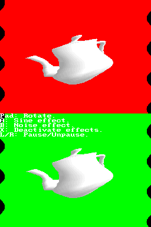
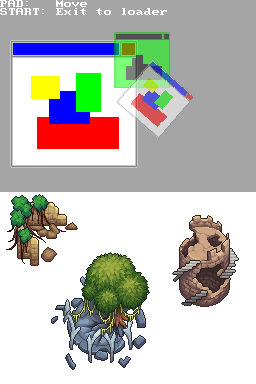

############
Nitro Engine
############

Introduction
============

This is a 3D game engine, a lot of functions designed to simplify the process of
making a 3D game. It isn't standalone, it needs libnds to work.

You can use Nitro Engine with `BlocksDS <https://blocksds.github.io/docs/>`_ and
devkitPro, but BlocksDS is preferred as some features of Nitro Engine are only
available with BlocksDS.

Features:

- Support for static models, converted from OBJ files.
- Support for animated models, thanks to the `DSMA library
  <https://github.com/AntonioND/dsma-library>`_, which converts MD5 models (with
  skeletal animation) into a format that can be rendered with hardware
  acceleration. It can also blend two animations together (for transitions).
- Support for all format of textures (even compressed textures, thanks to
  `ptexconv <https://github.com/Garhoogin/ptexconv>`_).
- Dual 3D (render 3D to both screens, but at 30 FPS instead of 60 FPS).
- Functions to render 2D images accelerated by 3D hardware.
- Text system based on `libDSF <https://github.com/AntonioND/libdsf>`_, which is
  based on `BMFont <https://www.angelcode.com/products/bmfont/>`_.
- Basic GUI elements like buttons and scrollbars.
- Basic physic system: Axis-aligned bounding boxes (AABB) only.

Nitro Engine doesn't support any of the 2D hardware of the DS. In order to use
the 2D hardware you can use libnds directly, or you can use a library like
`NFlib <https://github.com/knightfox75/nds_nflib>`_. There is an example of how
to integrate Nitro Engine and NFlib in the same project `here
<./examples/templates/using_nflib>`_.

Setup
=====

BlocksDS
--------

You can install this library with ``wf-pacman`` directly:

.. code:: bash

    wf-pacman -Sy blocksds-nitroengine

If you want to build the library from source, follow the instructions:

1. Clone this repository and run:

   .. code:: bash

       make install -j`nproc`

   This should build the library in both debug and release modes and install it.

2. If you want to check that everything is working as expected, open one of the
   folders of the examples and run:

   .. code:: bash

       make

   That should build an ``.nds`` file that you can run on an emulator or real
   hardware.

Note: The build system of the examples in this repository is make. The makefiles
aren't very flexible, and they don't support converting 3D models, or saving
graphics or models to the filesystem (you can only inject them as data to the
ARM9, which isn't acceptable for big games).

For BlocksDS, try `ArchitectDS <https://github.com/AntonioND/architectds>`_. This
build system written in Python supports converting every format that Nitro
Engine supports, and it lets you save everything in NitroFS so that your game
can grow as much as you want. ArchitectDS comes with plenty of examples of how
to use it with Nitro Engine.

devkitpro
---------

**NOTE**: This option is untested. It may not work with the last version of
devkitARM.

1. Clone this repository. Create a symbolic link to it inside the devkitPro
   folder in your system. For example, in Linux, create a symlink so that
   ``/opt/devkitpro/nitro-engine`` points to the folder with Nitro Engine:

   .. code:: bash

       ln -sT /path/to/nitro-engine /opt/devkitpro/nitro-engine

2. Go to the ``nitro-engine`` folder and type this on the terminal:

   .. code:: bash

       make dkp -j`nproc`

   This should build the library in both debug and release modes.

3. If you want to check that everything is working as expected, open one of the
   folders of the examples and type ``make -f Makefile.dkp``. That should build
   an ``.nds`` file that you can run on an emulator or real hardware.

Common
------

Note that some features of the 3D hardware aren't emulated by most emulators, so
you may need to use an actual NDS to test some things. **melonDS** seems to
emulate all features correctly. **DeSmuME** doesn't emulate the polygon/vertices
count registers, so the touch test feature of Nitro Engine doesn't work.

Normally you should link your programs with ``-lNE``, which is the release
version of Nitro Engine. If you want to use the debug features of Nitro Engine,
you should link with ``-lNE_debug``, and add ``-DNE_DEBUG`` to the ``CFLAGS``
and ``CPPFLAGS`` in your Makefile. Make sure to clean and rebuild your project
after doing the changes mentioned in this step. Check the **error_handling**
example to see how to use the debug mode of Nitro Engine.

Screenshots
===========

Screenshots of some of the examples included with Nitro Engine:

.. |box_tower| image:: screenshots/box_tower.png
.. |fog| image:: screenshots/fog.png

+------------------+-------------------+
| Animated model   | Box tower physics |
+------------------+-------------------+
| |animated_model| | |box_tower|       |
+------------------+-------------------+

+------------------+---------------------+
| Hardware fog     | Specular material   |
+------------------+---------------------+
| |fog|            | |specular_material| |
+------------------+---------------------+

+------------------+-------------------+
| Text             | Shadow volume     |
+------------------+-------------------+
| |text|           | |shadow_volume|   |
+------------------+-------------------+

+------------------+-------------------+
| Screen effects   | 2D sprites        |
+------------------+-------------------+
| |screen_effects| | |sprites|         |
+------------------+-------------------+

Contact
=======

This project is currently hosted on GitHub at:

    https://github.com/AntonioND/nitro-engine

If you want to contact me (Antonio Niño Díaz) directly you can email me at:

   antonio underscore nd at outlook dot com

License
=======

The code of this repository is under the MIT license. The examples are under the
CC0-1.0 license.

The full text of the licenses can be found under the ``licenses`` folder.

Future work
===========

- Asynchronous loading of assets (loading textures during VBL).

Thanks to
=========

- **devkitPro**: https://devkitpro.org/
- **DLDI**: https://www.chishm.com/DLDI/
- **DeSmuME**: http://desmume.org/
- **melonDS**: https://melonds.kuribo64.net/
- **no$gba**: https://problemkaputt.de/gba.htm
- **gbatek**: https://problemkaputt.de/gbatek.htm
- **gbadev forums**: https://forum.gbadev.org/
