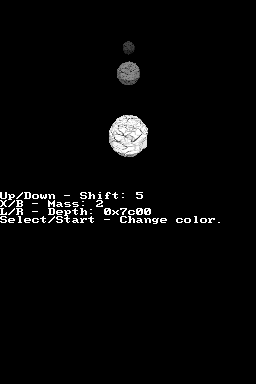

Nitro Engine v0.8.0
===================

Introduction
------------

This is a 3D game engine, a lot of functions designed to simplify the process of
making a 3D game. It isn't standalone, it needs libnds to work. However, if you
are developing for the NDS it is likely that you already have it installed. If
not, you need to install devkitARM and libnds.

Features:

- Support for static models, converted from OBJ files.
- Support for animated models, thanks to the `DSMA library
  <https://github.com/AntonioND/dsma-library>`_, which converts MD5 models (with
  skeletal animation) into a format that can be rendered with hardware
  acceleration. It can also blend two animations together (for transitions).
- Support for all format of textures (except compressed textures).
- Dual 3D (render 3D to both screens, but at 30 FPS instead of 60 FPS).
- Functions to render 2D images accelerated by 3D hardware.
- Basic text system.
- Basic GUI elements like buttons and scrollbars.
- Basic physic system: Axis-aligned bounding boxes (AABB) only.

Setup
-----

1. Clone this repository. Create a symbolic link) to it inside the devkitPro
   folder in your system. For example, in Linux, create a symlink so that
   ``/opt/devkitpro/nitro-engine`` points to the folder with Nitro Engine:

   .. code:: bash

       ln -sT /path/to/nitro-engine /opt/devkitpro/nitro-engine

2. Go to the ``nitro-engine`` folder and type this on the terminal:

   .. code:: bash

       make
       make NE_DEBUG=1

   This should build the library in both debug and release modes.

3. If you want to check that everything is working as expected, open one of the
   folders of the examples and type ``make``. That should build an ``.nds`` file
   that you can run on an emulator or real hardware. Note that some features of
   the 3D hardware aren't emulated by most emulators, so you may need to use an
   actual NDS to test some things. **melonDS** seems to emulate all features
   correctly. **DeSmuME** doesn't emulate the polygon/vertices count registers,
   so the touch test feature of Nitro Engine doesn't work.

4. Normally you should link your programs with ``-lNE``, which is the release
   version of Nitro Engine. If you want to use the debug features of Nitro
   Engine, you should link with ``-lNE_debug``, and add ``-DNE_DEBUG`` to the
   ``CFLAGS`` and ``CPPFLAGS`` in your Makefile. Make sure to clean and rebuild
   your project after doing the changes mentioned in this step. Check the
   **error_handling** example to see how to use the debug mode of Nitro Engine.

Screenshots
-----------

Screenshots of some of the examples included with Nitro Engine:

.. |animated_model| image:: screenshots/animated_model.png

.. |multiple_models| image:: screenshots/multiple_models.png
.. |screen_effects| image:: screenshots/screen_effects.png
.. |sprites| image:: screenshots/sprites.png

+------------------+-------------------+
| Animated model   | Box tower physics |
+------------------+-------------------+
| |animated_model| | |box_tower|       |
+------------------+-------------------+

+------------------+-------------------+
| Hardware fog     | Multiple models   |
+------------------+-------------------+
| |fog|            | |multiple_models| |
+------------------+-------------------+

+------------------+-------------------+
| Screen effects   | 2D sprites        |
+------------------+-------------------+
| |screen_effects| | |sprites|         |
+------------------+-------------------+

Contact
-------

This project is currently hosted on GitHub at:

    https://github.com/AntonioND/nitro-engine

If you want to contact me (Antonio Niño Díaz) directly you can email me at:

   antonio underscore nd at outlook dot com

License
-------

The code of this repository is under the MIT license. The examples are under the
CC0-1.0 license.

The full text of the licenses can be found under the ``licenses`` folder.

Future work
-----------

- Asynchronous loading of assets.
- Support for compressed textures.

Thanks to
---------

- **devkitPro**: https://devkitpro.org/
- **libnds**: https://github.com/devkitPro/libnds
- **DLDI**: https://www.chishm.com/DLDI/
- **DeSmuME**: http://desmume.org/
- **melonDS**: https://melonds.kuribo64.net/
- **no$gba**: https://problemkaputt.de/gba.htm
- **gbatek**: https://problemkaputt.de/gbatek.htm
- **gbadev forums**: https://forum.gbadev.org/
